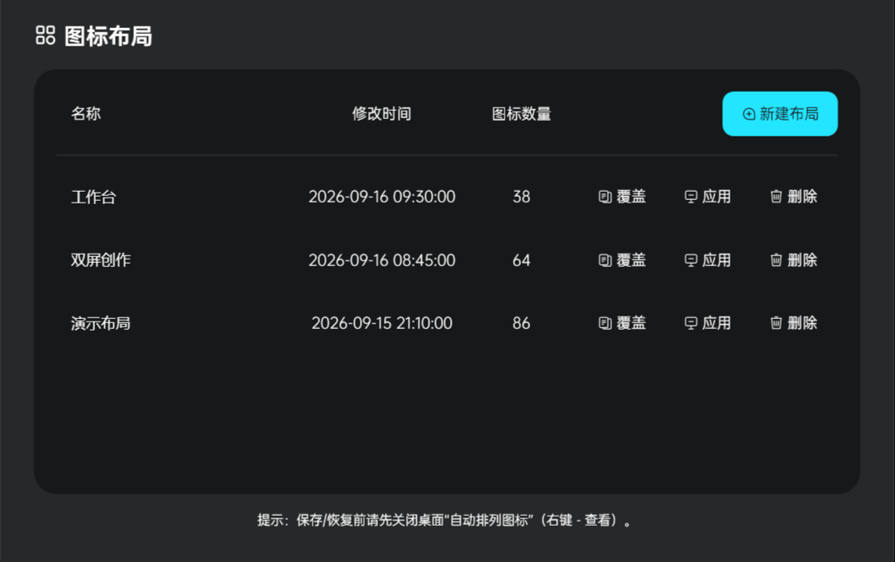
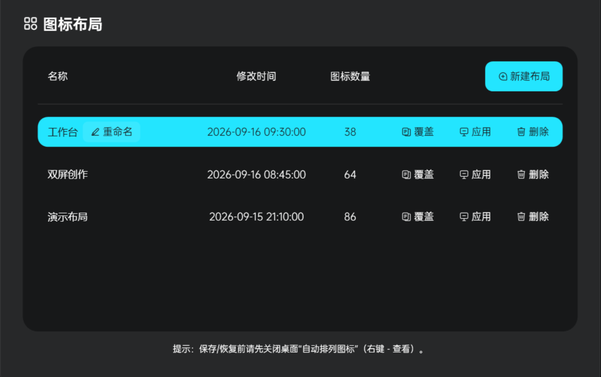

# DeskRewind

DeskRewind 是一个 Windows 桌面图标布局保存与恢复工具。它把图标坐标、图标大小、显示器硬件配置和系统缩放保存为布局记录，需要时可一键恢复，适合切换显示器、调整缩放或桌面排列被打乱后的快速复原。

<p align="center">
  
</p>

## 功能

- **保存桌面布局**：记录桌面图标坐标、图标大小、Shell 视图状态、显示器拓扑及每块屏幕的系统缩放。
- **按环境恢复**：应用前重新检查显示器硬件、系统缩放和图标大小，发现差异时先明确提示。
- **尽力处理换屏场景**：显示器硬件不一致时仍可尝试恢复可匹配的屏幕和图标，但不会承诺坐标完全一致。
- **管理多个版本**：每种显示器硬件配置最多保存 5 个布局，可重命名、覆盖、应用或删除。
- **原生单文件运行**：主界面与恢复引擎内嵌于一个 x64 WPF EXE，不需要安装 Python、PowerShell 或其他运行环境。
- **本地存储**：布局记录只保存在本机，不上传桌面文件名或显示器信息。
- **跟随系统主题**：自动适配 Windows 深色和浅色应用模式。

| 选择布局 | 恢复前确认 |
| --- | --- |
|  |  |

## 使用方法

1. 在桌面空白处右键，进入“查看”，关闭“自动排列图标”。
2. 运行 DeskRewind，点击“新建布局”并填写名称。
3. 桌面状态变化后，选择对应记录并点击“应用”。
4. 如果显示器、系统缩放或图标大小与保存时不同，确认提示内容后再继续。

“覆盖”会用当前桌面状态替换所选记录；“删除”会永久移除该记录。

## 下载

[下载 DeskRewind v1.0.0（Windows x64 单文件 EXE）](https://github.com/CreateLafont/deskrewind/releases/download/v1.0.0/DeskRewind.exe)

SHA-256：`29E96E8663BFA267B2CFABECF39A2D1804E1C4507ED5E7CAC15D7F9E42090497`

当前发布文件未进行代码签名，Windows 可能显示来源未知提示。

## 运行要求

- Windows 10 或 Windows 11，x64
- Explorer 桌面处于可交互状态
- 保存前关闭“自动排列图标”

## 数据位置

布局记录保存在：

```text
%LOCALAPPDATA%\DeskRewind\layouts.profiles.json
```

删除应用程序不会自动删除该文件。

## 从源码构建

在 Windows 命令行运行：

```bat
build-wpf.cmd
```

构建脚本使用 .NET Framework 4.x C# 编译器，将 WPF 界面、原生桌面恢复引擎、字体和图标资源合并为根目录下的 `DeskRewind.exe`。

## License

[MIT](LICENSE)
